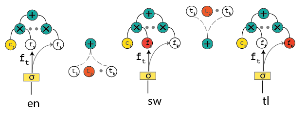

<div align='center'>

</div>

Y-Flow is an extension for Y-Flow a toolkit for text matching. Here at Yale we are developing a system for text matching for question answering, document ranking, paraphrase identification, and machine translation. The figure above indicates a surprise language coming to our system and we are going to use zero-shot learning approaches for transfer learning particularly for syntax. 

<table>
  <tr>
    <th width=30%, bgcolor=#999999 >Tasks</th> 
    <th width=20%, bgcolor=#999999>Text 1</th>
    <th width="20%", bgcolor=#999999>Text 2</th>
    <th width="20%", bgcolor=#999999>Objective</th>
  </tr>
  <tr>
    <td align="center", bgcolor=#eeeeee> Paraphrase Indentification </td>
    <td align="center", bgcolor=#eeeeee> string 1 </td>
    <td align="center", bgcolor=#eeeeee> string 2 </td>
    <td align="center", bgcolor=#eeeeee> classification </td>
  </tr>
  <tr>
    <td align="center", bgcolor=#eeeeee> Sentiment Analysis </td>
    <td align="center", bgcolor=#eeeeee> product </td>
    <td align="center", bgcolor=#eeeeee> review </td>
    <td align="center", bgcolor=#eeeeee> classification </td>
  </tr>
  <tr>
    <td align="center", bgcolor=#eeeeee> Sentence Matching </td>
    <td align="center", bgcolor=#eeeeee> sentence 1 </td>
    <td align="center", bgcolor=#eeeeee> sentence 2 </td>
    <td align="center", bgcolor=#eeeeee> score </td>
  </tr>
  <tr>
    <td align="center", bgcolor=#eeeeee> Textual Entailment </td>
    <td align="center", bgcolor=#eeeeee> text </td>
    <td align="center", bgcolor=#eeeeee> hypothesis </td>
    <td align="center", bgcolor=#eeeeee> classification </td>
  </tr>
  <tr>
    <td align="center", bgcolor=#eeeeee> Question Answer </td>
    <td align="center", bgcolor=#eeeeee> question </td>
    <td align="center", bgcolor=#eeeeee> answer </td>
    <td align="center", bgcolor=#eeeeee> classification/ranking </td>
  </tr>
  <tr>
    <td align="center", bgcolor=#eeeeee> Conversation </td>
    <td align="center", bgcolor=#eeeeee> dialog </td>
    <td align="center", bgcolor=#eeeeee> response </td>
    <td align="center", bgcolor=#eeeeee> classification/ranking </td>
  </tr>
  <tr>
    <td align="center", bgcolor=#eeeeee> Information Retrieval </td>
    <td align="center", bgcolor=#eeeeee> query </td>
    <td align="center", bgcolor=#eeeeee> document </td>
    <td align="center", bgcolor=#eeeeee> ranking </td>
  </tr>
</table>

## Installation
Please clone the repository and run
```
git clone https://github.com/javiddadashkarimi/Y-Flow.git
cd Y-Flow
python setup.py install
```
In the main directory, this will install the dependencies automatically.

For usage examples, you can run
```
python material.py -src en -tgt sw -c=en -m mt

```
    -'--source','-src', default='en', help='source language [sw,tl,en]'
    -'--target','-tgt', default='sw', help='target language [sw,tl,en]'
    -'--collection','-c', default='en', help='language of documents [sw,tl,en]'
    -'--out','-o', default='en', help='output language [sw,tl,en]')
    -'--method','-m', default='mt', help='method [mt,google,wiktionary,fastext]'

### Data Preparation
The data preparation module aims to convert dataset of different text matching tasks into a unified format as the input of deep matching models. Users provide datasets which contains pairs of texts along with their labels, and the module produces the following files.

+	**Word Dictionary**: records the mapping from each word to a unique identifier called *wid*. Words that are too frequent (e.g. stopwords), too rare or noisy (e.g. fax numbers) can be  filtered out by predefined rules.
+	**Corpus File**: records the mapping from each text to a unique identifier called *tid*, along with a sequence of word identifiers contained in that text. Note here each text is truncated or padded to a fixed length customized by users.
+	**Relation File**: is used to store the relationship between two texts, each line containing a pair of *tids* and the corresponding label.
+   **Detailed Input Data Format**: a detailed explaination of input data format can be found in Y-Flow/data/example/readme.md.

### Model Construction
In the model construction module, we employ Keras library to help users build the deep matching model layer by layer conveniently. The Keras libarary provides a set of common layers widely used in neural models, such as convolutional layer, pooling layer, dense layer and so on. To further facilitate the construction of deep text matching models, we extend the Keras library to provide some layer interfaces specifically designed for text matching.

Moreover, the toolkit has implemented two schools of representative deep text matching models, namely representation-focused models and interaction-focused models [[Guo et al.]](http://www.bigdatalab.ac.cn/~gjf/papers/2016/CIKM2016a_guo.pdf).

### Training and Evaluation
For learning the deep matching models, the toolkit provides a variety of objective functions for regression, classification and ranking. For example, the ranking-related objective functions include several well-known pointwise, pairwise and listwise losses. It is flexible for users to pick up different objective functions in the training phase for optimization. Once a model has been trained, the toolkit could be used to produce a matching score, predict a matching label, or rank target texts (e.g., a document) against an input text.

## Benchmark Results:
Here, we adopt <a href="https://www.microsoft.com/en-us/download/details.aspx?id=52419">WikiQA</a> dataset for an example to inllustrate the usage of Y-Flow. WikiQA is a popular benchmark dataset for answer sentence selection in question answering. We have provided <a href="./data/WikiQA/run_data.sh">a script</a> to download the dataset, and prepared it into the Y-Flow data format. In the <a href="">models directory</a>, there are a number of configurations about each model for WikiQA dataset. 

Take the DRMM as an example. In training phase, you can run
```
python matchzoo/main.py --phase train --model_file examples/wikiqa/config/drmm_wikiqa.config
```
In testing phase, you can run
```
python matchzoo/main.py --phase predict --model_file examples/wikiqa/config/drmm_wikiqa.config
```

Here, the DRMM_TKS is a variant of DRMM for short text matching. Specifically, the matching histogram is replaced by a top-k maxpooling layer and the remaining part are fixed. 

## Model Detail:

1. DRMM : this model is an implementation of <a href="http://www.bigdatalab.ac.cn/~gjf/papers/2016/CIKM2016a_guo.pdf">A Deep Relevance Matching Model for Ad-hoc Retrieval</a>.

- model file: models/drmm.py
- model config: models/drmm_ranking.config

2. MatchPyramid : this model is an implementation of <a href="https://arxiv.org/abs/1602.06359"> Text Matching as Image Recognition</a>

- model file: models/matchpyramid.py
- model config: models/matchpyramid_ranking.config

3. ARC-I : this model is an implementation of <a href="https://arxiv.org/abs/1503.03244">Convolutional Neural Network Architectures for Matching Natural Language Sentences</a>

- model file: models/arci.py
- model config: models/arci_ranking.config

4. DSSM : this model is an implementation of <a href="https://www.microsoft.com/en-us/research/wp-content/uploads/2016/02/cikm2013_DSSM_fullversion.pdf">Learning Deep Structured Semantic Models for Web Search using Clickthrough Data</a>

- model file: models/dssm.py
- model config: models/dssm_ranking.config

5. CDSSM : this model is an implementation of <a href="https://www.microsoft.com/en-us/research/publication/learning-semantic-representations-using-convolutional-neural-networks-for-web-search/">Learning Semantic Representations Using Convolutional Neural Networks for Web Search</a>

- model file: models/cdssm.py
- model config: models/cdssm_ranking.config

6. ARC-II : this model is an implementation of <a href="https://arxiv.org/abs/1503.03244">Convolutional Neural Network Architectures for Matching Natural Language Sentences</a>

- model file: models/arcii.py
- model config: models/arcii_ranking.config

7. MV-LSTM : this model is an implementation of <a href="https://arxiv.org/abs/1511.08277">A Deep Architecture for Semantic Matching with Multiple Positional Sentence Representations</a>

- model file: models/mvlstm.py
- model config: models/mvlstm_ranking.config

8. aNMM : this model is an implementation of <a href="http://maroo.cs.umass.edu/pub/web/getpdf.php?id=1240">aNMM: Ranking Short Answer Texts with Attention-Based Neural Matching Model</a>
- model file: models/anmm.py
- model config: models/anmm_ranking.config


9. DUET : this model is an implementation of <a href="https://dl.acm.org/citation.cfm?id=3052579">Learning to Match Using Local and Distributed Representations of Text for Web Search</a>

- model file: models/duet.py
- model config: models/duet_ranking.config

10. models under development:

<a href="https://arxiv.org/abs/1604.04378">Match-SRNN</a>, <a href="https://arxiv.org/abs/1710.05649">DeepRank</a>, <a href="https://arxiv.org/abs/1706.06613">K-NRM</a> ....

## Citation

```
@article{fan2017matchzoo,
  title={Y-Flow: A Toolkit for Deep Text Matching},
  author={Fan, Yixing and Pang, Liang and Hou, JianPeng and Guo, Jiafeng and Lan, Yanyan and Cheng, Xueqi},
  journal={arXiv preprint arXiv:1707.07270},
  year={2017}
}
```

## Environment
* python2.7+
* tensorflow 1.2+
* keras 2.06+
* nltk 3.2.2+
* tqdm 4.19.4+
* h5py 2.7.1+

